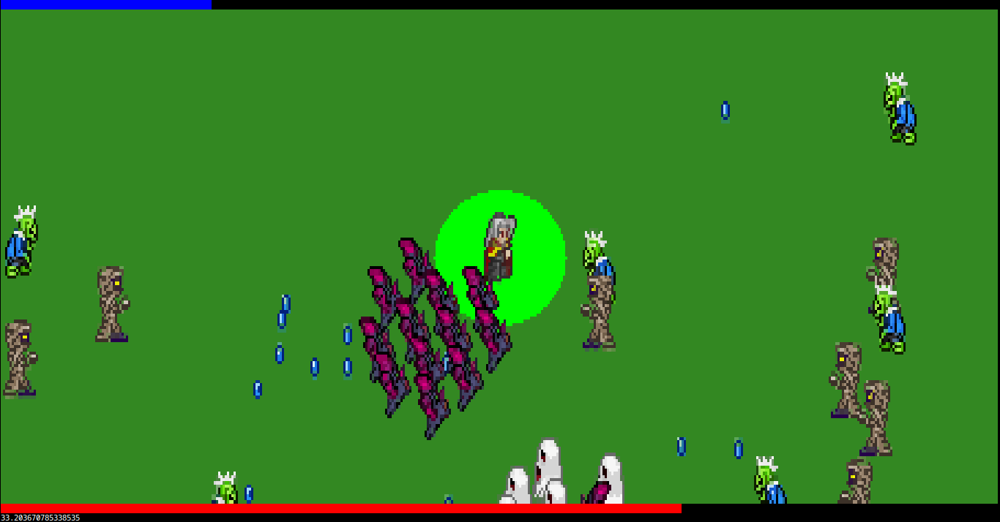

# Survivor

Survivor is a graphical action game for the Linux terminal. It is havily
inspired by Vampire Survivors.

The player controls an automatically attacking character, with the goal to
survive for as long as possible. Killed enemies drop diamonds that can be
collected to gain XP. When the blue XP bar at the top of the screen is full
the player receives a random perk:

-	Damage is increased by 10%
-	Max health is increased by 10%
-	Movement speed is increased by 10%
-	Damage radius is increased by 10%
-	Pickup radius is increased by 10%
-	Experience from diamonds is increased by 10%
-	Weapon cooldown is decreased by 10%
-	Full health is restored
-	The player recovers +0.2HP per second
-	Get an additional axe
-	Get an additional knive
-	Get an additional shuriken
-	Get an additional whirlwind

## Installation

The game is written in rust and does not have any dependencies outside the
standard library and libc. You can run `cargo run` to build and execute it.

## Controls

-	Up/w: move up
-	Right/d: move right
-	Down/s: move down
-	Left/a: move left
-	Space: stop moving
-	q: quit

## Artwork

The sprites are based on artwork from [Vampires Dawn
2](https://www.vampiresdawn.org/).

## FAQ

### Why did you do this?

I had wanted to create a graphical action game for the terminal for a long
time. This kind of game felt like a good fit for the particular restrictions
that come with the terminal.

Also, Vampire Survivors takes a full minute to load and then full saturates the
CPU on my laptop, even in the menu. I wanted to prove to myself that that is
not necessary.

### Why does the character not stop when I release the movement keys?

Terminals do not have a concept of key release events. That is actually a major
reason why it is so hard to create games for the terminal. There are [proposals
to add proper keyboard events](https://sw.kovidgoyal.net/kitty/keyboard-protocol/),
but so far they have not gained much traction.

### Why are there so many graphical artifacts?

Each cell of the terminal is subdivided into 2x3 pixels. This way we can get a
decent resolution. However, each cell can only have two colors. Artifacts
happen when the game tries to draw more then two colors into a single cell.

### I get a bad frame rate. Is there anything I can do?

The game is designed to run on 30fps. The amount of computation that needs to
be done scales with the size of the window. So if you get a bad frame rate,
there is a good chance that it will improve if you reduce the window size.

### Things are stretched in one direction, circles are ovals

The aspect ratio of pixels depends on the font. You can adjust
`win::ASPECT_RATIO` to compensate for that.

## Brief tour of the code

-	`src/main.rs` contains the main loop.
-	`src/game.rs` contains most of the game logic.
-	`src/input.rs`, `src/random.rs`, and `src/term,rs` wrap unsafe libc functions
	for low level functionality.
-	`src/enemies.rs`  contains all the enemy types as well as the waves in which
	they appear.
-	`src/sprites.rs` contains all graphics. The sprites are stored in
	[ppm](https://en.wikipedia.org/wiki/Netpbm_format) files and converted to
	rust arrays by the `include_ppm!()` macro. That way all graphics are included
	in the binary. The color of the first pixel in a sprite is considered
	transparent.
-	`src/win.rs` contains some drawing primitives as well as the conversion
	between logical positions and screen pixels.

Most game logic is expressed as `f32`. Positions represet the logical center of
objects. When drawing to the screen, the `f32` positions are converted to
`usize` pixels. Game logic is mostly independent of pixels though. The only
exceptions are that enemy spawn and despawn outside of the screen, so they
depend on the screen size.

## TODO (patches welcome)

-	Let the player pick a perk on level up
-	Improve balancing
-	Add tarain
-	More enemy waves
-	Sound
